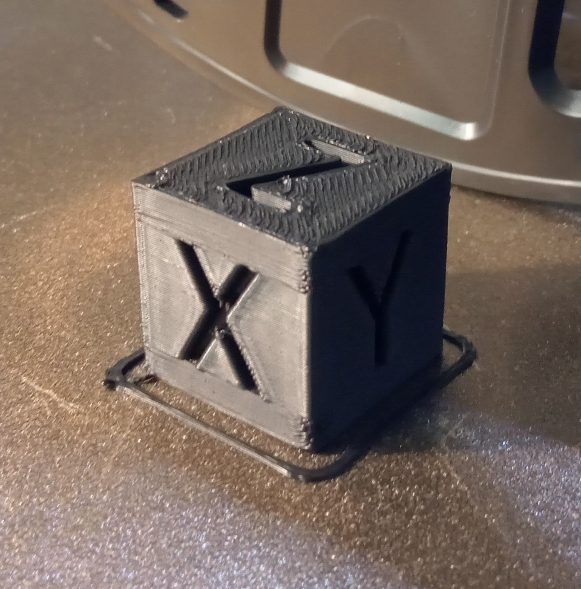
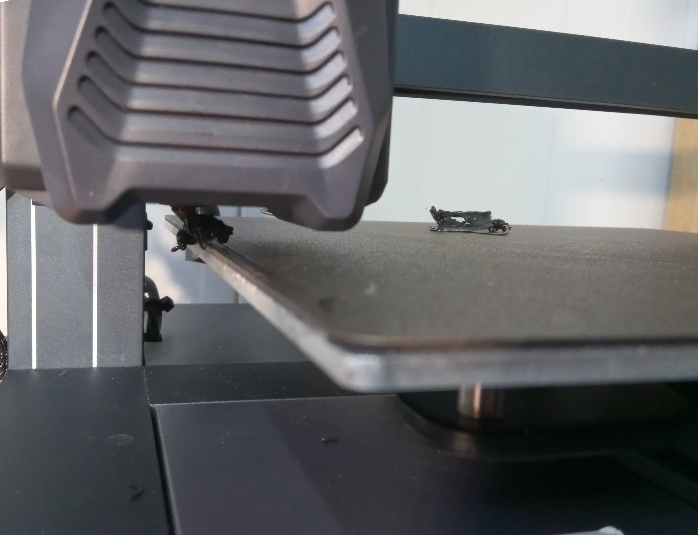
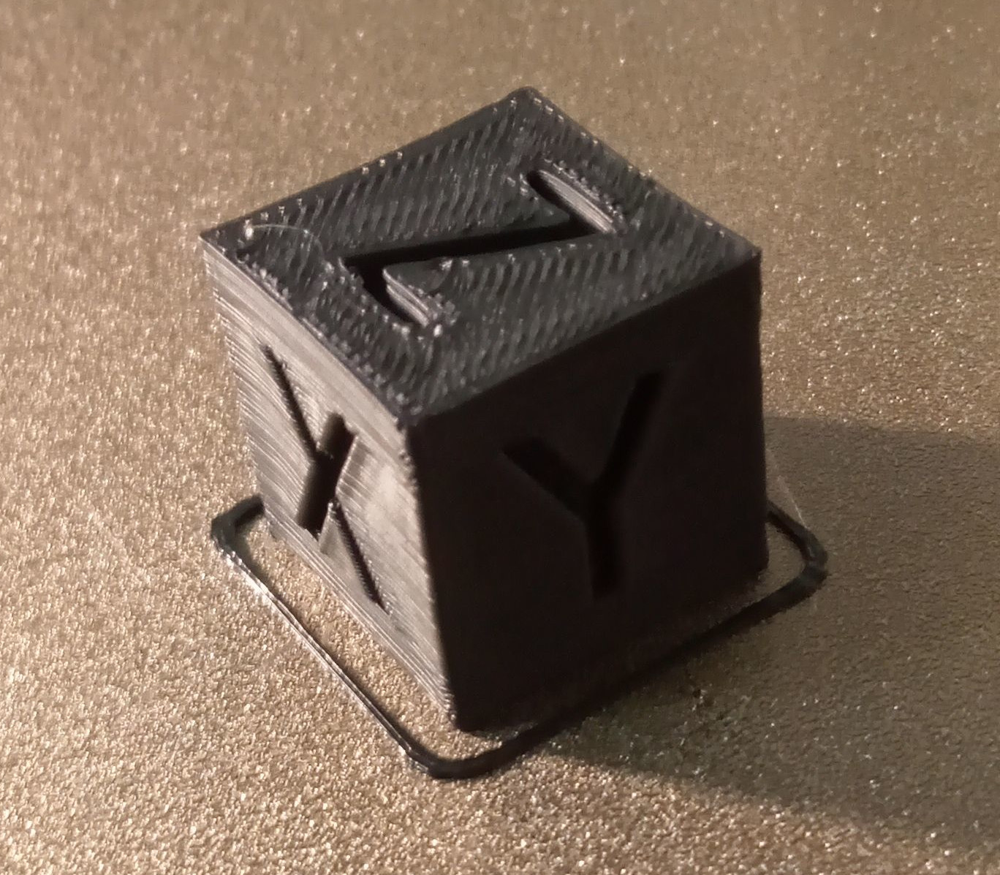
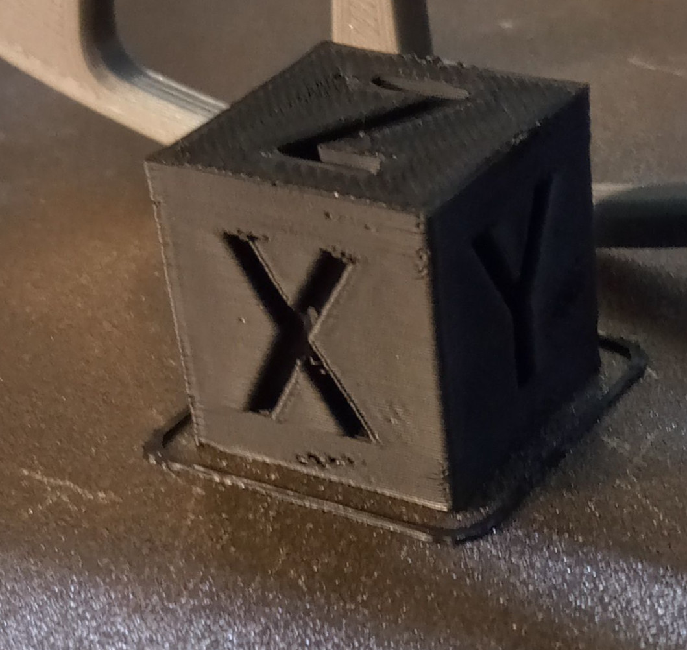
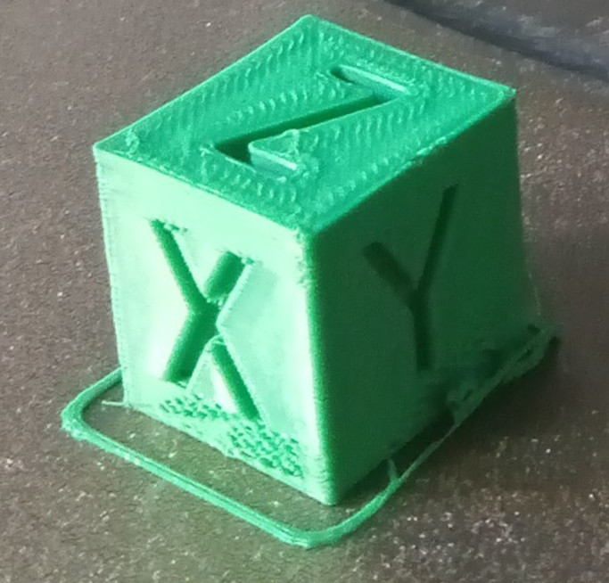
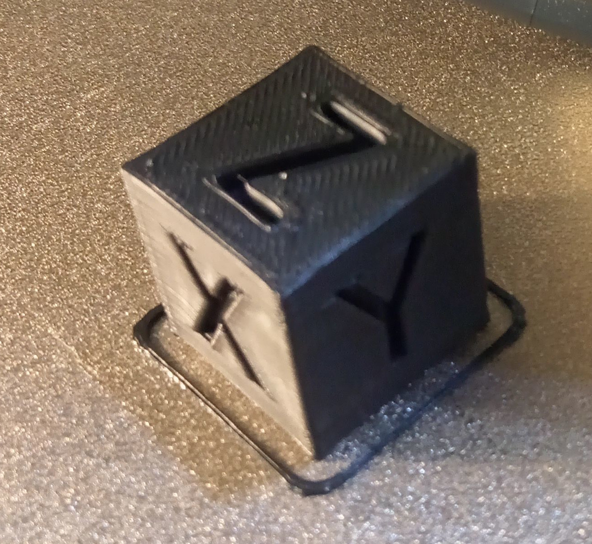

+++
title = '3D Tisk - benchmarky filamentů'
seradit = 4
draft = true
+++
*Zdravím, níže si ukážeme kalibrační kostku tisknutou z několika různých filamentů. Tiskárna na které benchmarky dělám je Elegoo neptune 3 Pro. Každý filament ohodnotím hvězdičkama. Maximum je 5*

**Nastavení tiskárny:**
1) Rychlost tisku: 500mm/s (maximum)
2) Teplota trysky při první vrstvě: 210°C
3) Teplota trysky při ostatních vrstvách: 205°C
4) Teplota podložky (bed): 60°C

**Výtisky můžou vypadat úplně jinak u jiných teplot a pomalejšího tisku!!!**
**Při hodnocení beru ohled na rychlost tisku!!!**

**Testované filamenty:**
1) Creality
2) Prusament
3) Aurapool
4) Colorfil
5) Premium Filament (PF)

**Creality:**

*Hodnocení:* ⭐⭐⭐⭐⭐

**Prusament:**

*První pokus:*

*Druhý pokus:*

*Hodnocení:* ⭐⭐⭐

**Aurapool:**

U tohoto filamentu byla neúplná první vrstva. (ze spodu) Byli v ní díry. Foto bohužel nemám. (Kostky už jsem rozdal.)

*Hodnocení:* ⭐⭐

**Colorfil:**

*Hodnocení:* ⭐⭐⭐⭐⭐

**Premium Filament (PF):**

*První pokus:*

Ucpaná tryska.

*Druhý pokus:*

Odlepení od podložky. (nízká přilnavost k podložce)

*Třetí pokus:*

*Hodnocení:* 0

